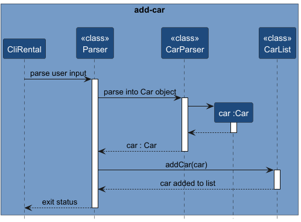
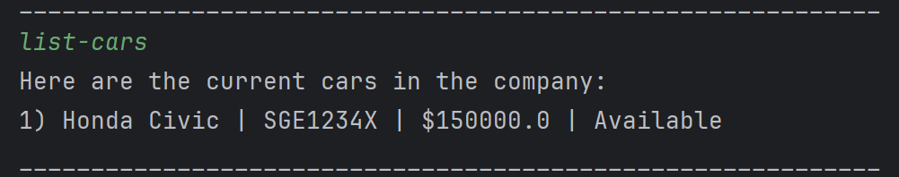
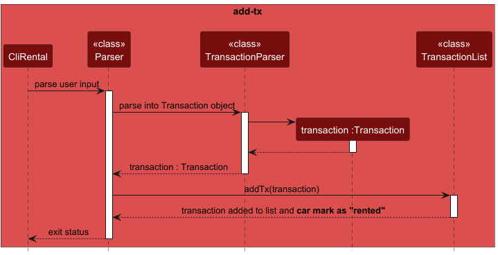
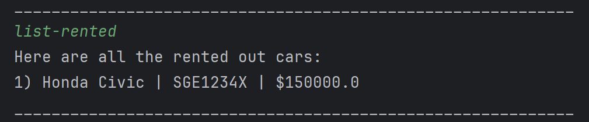
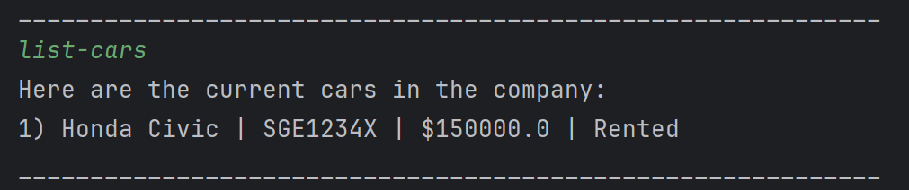
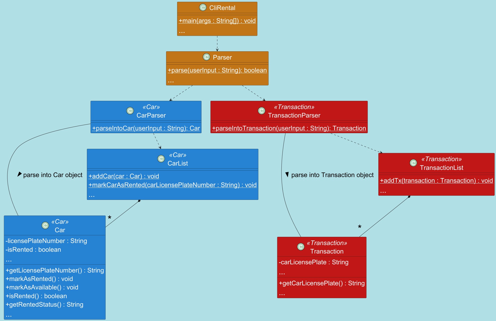

# Developer Guide

## Acknowledgements

{list here sources of all reused/adapted ideas, code, documentation, and third-party libraries -- include links to the original source as well}

## Design & implementation

### Auto updating of car rental status feature

### Implementation:

Every car added to the car list will have a default rental status of **'Available'**.
Once a valid transaction has been made and added to the transaction list, the particular car,
identified by its **unique identifier (i.e. license plate number)**, will automatically be
marked as **'Rented'**.

Given below is a step-by-step execution of the implementation:

Step 1: The user launches the application and enters the `add-car ...` command to add a new
car to the list, specifying the model name, car license plate number and price of the car.

> **Note**: If the command fails due to invalid parameters or format,
the car will not be added to the list.

The following sequence diagram illustrates a **valid** `add-car` operation:

Step 2: The user enters the `list-cars` command to verify that the car has been successfully added
to the car list.

-> show code output

Example:

Step 3: A customer decides to rent a car from the company. The user then uses the application to track
and record the transaction details. The user executes the `add-tx ...` command to add
a new transaction record, specifying details like the car license plate number.

> **Note**: If the command fails due to invalid parameters or format,
the transaction will not be added to the list and the car rental status remains as **'Available'**.

The following sequence diagram illustrates a **valid** `add-tx` operation:

Step 4: After adding the transaction, the rental status of the selected car will now be updated to **'Rented'**.
The user finally executes the `list-rented` command to list all rented out cars. The car that
was just rented out should appear in the list, together with other rented out cars (if any).

Example:

Step 5: **Optionally**, the user can also execute 
the `list-cars` command to view the rental status of all
the cars. By doing so, the rental status of the car that was just rented out,
should now have a rental status of **'Rented'** instead of **'Available'**.

-> show code output

Example:

> **Note**: The rental status is now updated to **'Rented'**.
> (compare with output in **Step 2**)

The following class diagram shows the interaction between the classes:

### Rationale behind way of implementation:
Modelled after the real world, the car is only rented out once the transaction (payment) is complete.
For our application, after adding a transaction, it signifies that the 
transaction was successful and complete. As such, the car should be rented out after that. Therefore, 
the car's rental status is automatically updated once a new transaction record is added.

### Alternatives considered:
- **Alternative 1 (current choice):** Automatically update car rental status
  - Pros: 
    - Improve effectiveness and efficiency (E&E)
    - Easy to implement
    - No need for additional commands
  - Cons: 
    - Does not adhere to software design principles like Single 
Responsibility principle (SRP) or Separation of Concerns principle (SOC).
- **Alternative 2:** Manually update car rental status
  - Pros: 
    - Adheres to the software design principles and makes the code more OOP. 
  - Cons:
    - Possibility that user might forget to update rental status
    - Need to add new commands to update rental status (e.g. `mark-rented`) 

## Product scope
### Target user profile

{Describe the target user profile}

### Value proposition

{Describe the value proposition: what problem does it solve?}

## User Stories

|Version| As a ... | I want to ... | So that I can ...|
|--------|----------|---------------|------------------|
|v1.0|new user|see usage instructions|refer to them when I forget how to use the application|
|v2.0|user|find a to-do item by name|locate a to-do without having to go through the entire list|

## Non-Functional Requirements

{Give non-functional requirements}

## Glossary

* *glossary item* - Definition

## Instructions for manual testing

{Give instructions on how to do a manual product testing e.g., how to load sample data to be used for testing}
